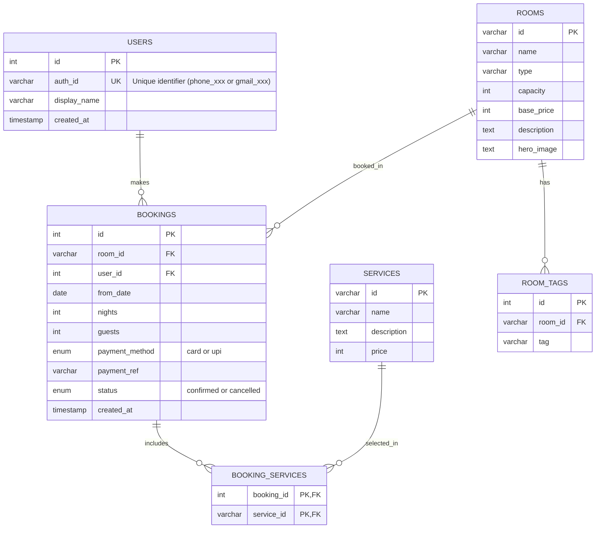

# Moonlit Cove Resort - Entity Relationship Diagram

## ER Diagram (Mermaid Format)

## Relationships

1. **USERS → BOOKINGS** (One-to-Many)
   - One user can make multiple bookings
   - Each booking belongs to one user

2. **ROOMS → BOOKINGS** (One-to-Many)
   - One room can have multiple bookings (at different times)
   - Each booking is for one room

3. **ROOMS → ROOM_TAGS** (One-to-Many)
   - One room can have multiple tags
   - Each tag belongs to one room

4. **BOOKINGS ↔ SERVICES** (Many-to-Many via BOOKING_SERVICES)
   - One booking can include multiple services
   - One service can be in multiple bookings
   - Junction table: BOOKING_SERVICES

## Table Descriptions

### USERS
- Stores user authentication and profile information
- `auth_id`: Unique identifier (e.g., "phone_+919876543210" or "gmail_user@example.com")
- `display_name`: User's display name

### ROOMS
- Stores room types and details
- `id`: Unique room identifier (e.g., "moon-suite", "cove-retreat")
- `base_price`: Price per night in INR

### ROOM_TAGS
- Stores tags/features for each room (e.g., "Ocean view", "Private balcony")
- Many-to-one relationship with ROOMS

### SERVICES
- Stores optional services (e.g., "Moonlight Spa Ritual", "Private Cove Dinner")
- `id`: Unique service identifier (e.g., "spa-ritual", "private-dinner")

### BOOKINGS
- Stores booking transactions
- `from_date`: Check-in date
- `nights`: Number of nights
- `status`: "confirmed" or "cancelled"
- Foreign keys to USERS and ROOMS

### BOOKING_SERVICES
- Junction table linking bookings to services
- Composite primary key: (booking_id, service_id)
- Allows many-to-many relationship between bookings and services

